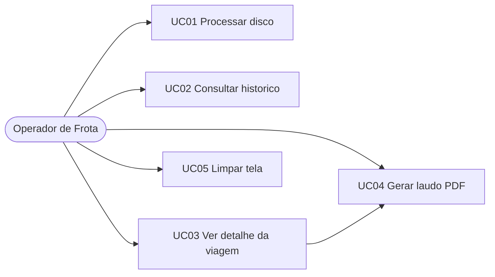
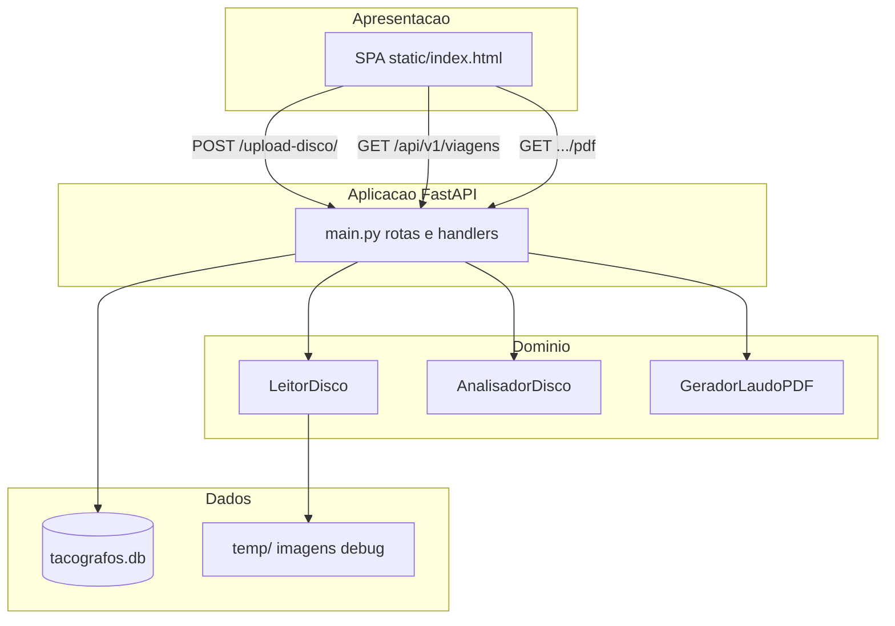
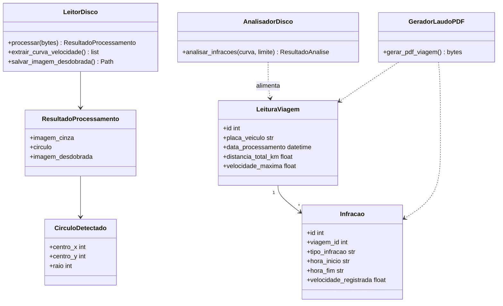
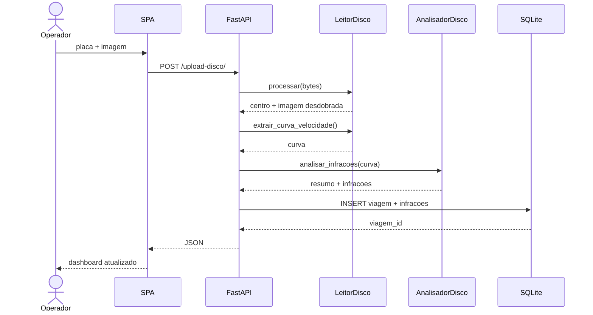
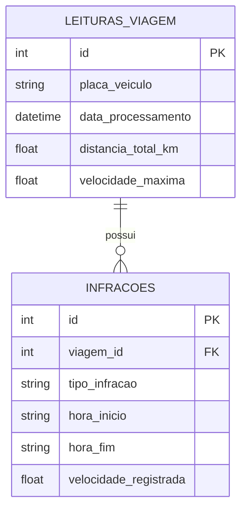

# Documentação complementar — Engenharia de Software 2

**Disciplina:** Engenharia de Software 2  
**Curso:** Sistemas para Internet — Univali  
**Produto:** CronotaScan (Galaxy Pro)  
**Repositório:** https://github.com/jbr121/CRONOTACOGRAFOS  

Este arquivo **não substitui** o [`PLANO_DE_IMPLEMENTACAO.md`](PLANO_DE_IMPLEMENTACAO.md) nem o [`README.md`](README.md).  
É um **anexo extra** para a disciplina de ES2 e também serve como base de produto de mercado (auditoria de frotas).

---

## 1. Identificação do produto

| Item | Descrição |
| --- | --- |
| Nome comercial | CronotaScan |
| Marca | Galaxy Pro |
| Tipo | Software web local (SPA + API) para leitura de discos de cronotacógrafo analógico |
| Problema | Leitura manual do papel diagrama de 24 h é lenta, subjetiva e difícil de auditar |
| Solução | Visão computacional + regras de negócio + histórico + laudo PDF |
| Público | Gestor de frota, auditor interno, transportadora |
| Ambiente | Windows, execução local (`http://127.0.0.1:8081/`) |

---

## 2. Visão de mercado (além do trabalho acadêmico)

O CronotaScan nasce como protótipo acadêmico, mas o fluxo já é o de um **produto operacional**:

1. Operador fotografa/escaneia o disco.
2. Informa a placa e envia a imagem.
3. O sistema extrai a curva de velocidade, aponta excessos e paradas.
4. Grava o histórico por veículo.
5. Emite laudo PDF para arquivo / auditoria.

**Proposta de valor:** reduzir tempo e erro da conferência visual do disco, padronizar o relatório e criar histórico por placa.

**Fora do escopo atual (backlog de produto):** conta de usuário, multiempresa, nuvem, app mobile, reconhecimento automático de manuscritos do miolo, integração com ERPs de frota.

---

## 3. Stakeholders

| Stakeholder | Interesse |
| --- | --- |
| Gestor de frota | Ver excessos, paradas e quilometragem estimada por veículo |
| Auditor / compliance | Laudo reproduzível (PDF) com evidência visual do desdobramento |
| Operador de leitura | Fluxo curto: placa → foto → resultado |
| Equipe de desenvolvimento | Código modular, fácil de defender e evoluir |
| Banca / professor de ES2 | Requisitos, casos de uso, arquitetura, processo e rastreabilidade |

---

## 4. Processo de desenvolvimento

Processo **iterativo incremental** (estilo Scrum), com sprints já executadas no repositório:

| Sprint | Entrega | Status |
| --- | --- | --- |
| 1 | OpenCV + FastAPI + desdobramento polar | Concluída |
| 2 | Ruído, infrações, SQLite, dashboard | Concluída |
| 3 | Histórico de viagens (listar / filtrar / detalhar) | Concluída |
| 4 | Laudo PDF de auditoria | Concluída |
| 5 | Robustez (CLAHE, centro verde, perspectiva, UX de erro) | Concluída |

Cada sprint gerou incremento utilizável (não apenas documentação).

---

## 5. Requisitos (estado atual do código)

### 5.1 Funcionais

| ID | Requisito | Status |
| --- | --- | --- |
| RF01 | Upload de imagem PNG/JPG do disco | Implementado |
| RF02 | Informar placa obrigatória | Implementado |
| RF03 | Detectar centro pela grade verde (fallback Hough/furo) | Implementado |
| RF04 | Corrigir perspectiva elipse → círculo quando necessário | Implementado |
| RF05 | Desdobrar anel de velocidade (polar → cartesiana) | Implementado |
| RF06 | Extrair curva tempo × km/h com filtro de ruído | Implementado |
| RF07 | Detectar excesso de velocidade (limite padrão 80 km/h) | Implementado |
| RF08 | Detectar parada prolongada (> 10 min) | Implementado |
| RF09 | Estimar distância da viagem | Implementado |
| RF10 | Persistir viagem e infrações em SQLite | Implementado |
| RF11 | Dashboard (métricas, gráfico, imagem, alertas) | Implementado |
| RF12 | Listar histórico e filtrar por placa | Implementado |
| RF13 | Abrir detalhe de viagem passada | Implementado |
| RF14 | Gerar laudo PDF | Implementado |
| RF15 | Tratamento de erro amigável (imagem inválida / centro não encontrado) | Implementado |

### 5.2 Não funcionais

| ID | Requisito | Como foi atendido |
| --- | --- | --- |
| RNF01 | Modularidade | `core/` (visão, regras, banco, PDF) separado da API e da UI |
| RNF02 | Usabilidade | SPA única, tema Galaxy Pro, spinner e alerta de erro |
| RNF03 | Portabilidade local | SQLite + `requirements.txt` + `python main.py` |
| RNF04 | Manutenibilidade | Type hints e comentários em português |
| RNF05 | Disponibilidade de evidência | Imagem desdobrada em `temp/` e incorporada no PDF |
| RNF06 | Robustez a luz/ângulo | CLAHE, máscara HSV verde, correção de elipse |

---

## 6. Atores e casos de uso

**Atores:** Operador de Frota, Sistema CronotaScan.

### UC01 — Processar disco (principal)

| Campo | Conteúdo |
| --- | --- |
| Ator | Operador |
| Pré-condição | Servidor no ar; imagem PNG/JPG disponível |
| Fluxo principal | 1. Informa placa. 2. Seleciona arquivo. 3. Envia. 4. Sistema processa, analisa, grava e exibe dashboard. |
| Fluxos alternativos | Placa vazia; arquivo ausente; imagem ilegível; centro não detectado — mensagem em português, sem travar a tela. |
| Pós-condição | Viagem e infrações persistidas; métricas e gráfico visíveis. |

### UC02 — Consultar histórico

Filtrar por placa (opcional) e listar data, distância, vel. máxima e total de infrações.

### UC03 — Ver detalhe da viagem

Carregar resumo e tabela de infrações de um `viagem_id` já gravado.

### UC04 — Gerar laudo PDF

Abrir `/api/v1/viagens/{id}/pdf` em nova aba (cabeçalho, resumo, imagem, infrações, rodapé).

### UC05 — Limpar / novo escaneamento

Resetar formulário e painel para a próxima leitura.

---

## 7. Arquitetura lógica

Estilo **em camadas**, execução monolítica local (adequado ao MVP de mercado e à defesa acadêmica).

| Camada | Arquivo | Responsabilidade |
| --- | --- | --- |
| Apresentação | `static/index.html` | Upload, dashboard, histórico, identidade Galaxy Pro |
| Aplicação | `main.py` | HTTP, validação, orquestração, erros padronizados |
| Visão computacional | `core/processador_imagem.py` | Centro, desdobramento, curva |
| Regras | `core/analisador.py` | Excesso, parada, distância |
| Relatório | `core/gerador_pdf.py` | Laudo A4 |
| Persistência | `core/database.py` | ORM SQLite |

---

## 8. Diagrama de classes (domínio)

---

## 9. Diagrama de sequência — UC01

---

## 10. Modelo de dados

`tipo_infracao`: `excesso_velocidade` ou `parada_prolongada`.

---

## 11. Regras de negócio (rastreáveis no código)

| ID | Regra | Onde |
| --- | --- | --- |
| RN01 | Limite padrão de velocidade = 80 km/h | `AnalisadorDisco` |
| RN02 | Parada prolongada = velocidade ≈ 0 por mais de 10 minutos | `MINUTOS_PARADA_PROLONGADA` |
| RN03 | Distância = integração velocidade × tempo (estimativa) | `_calcular_distancia_km` |
| RN04 | Escala do disco: X ≈ 24 h, Y ≈ 0–120 km/h | `LeitorDisco` |
| RN05 | Centro preferencial = grade verde impressa, não o furo rasgado | `encontrar_centro_pela_grade_verde` |
| RN06 | Placa é obrigatória para gravar a leitura | `POST /upload-disco/` + formulário |

---

## 12. Plano de testes (ES2)

| Tipo | O que validar | Como |
| --- | --- | --- |
| Funcional | Upload com placa + imagem válida | Resultado no dashboard + linha no histórico |
| Alternativo | Imagem sem disco / escura | HTTP 400/422 e alerta vermelho, tela não trava |
| Regressão | Mesmo disco, fotos com luz diferente | Distância e vel. máx. próximas (não “1083 vs 41”) |
| Integração | Histórico e PDF | `GET /api/v1/viagens` e `/pdf` abrem |
| Usabilidade | Fluxo do operador | Menos de 1 minuto da foto ao laudo |
| Smoke | Subida do servidor | `GET /api/health` e `GET /` |

Roteiro passo a passo de execução: [`TUTORIAL.md`](TUTORIAL.md).

---

## 13. Riscos e mitigações

| Risco | Impacto | Mitigação atual |
| --- | --- | --- |
| Foto em ângulo (elipse) | Curva ondulada / km errado | `corrigir_perspectiva` |
| Sombra / reflexo | Traço some ou vira “infração falsa” | CLAHE + morfologia CLOSE/OPEN |
| Centro no furo pera | warpPolar senoidal | Máscara verde + `minEnclosingCircle` |
| Disco amassado / manuscrito no miolo | Leitura ruim | Recorte do anel de velocidade (`fracao_raio_min/max`) |
| Dependência de iluminação | Produto ainda é MVP | Orientar foto controlada; evoluir calibração |

---

## 14. Matriz de rastreabilidade (resumo)

| Requisito | Caso de uso | Componente | Evidência |
| --- | --- | --- | --- |
| RF01–RF06 | UC01 | `LeitorDisco` | Imagem desdobrada + curva |
| RF07–RF09 | UC01 | `AnalisadorDisco` | Cards e tabela de alertas |
| RF10 | UC01 | `database.py` | `tacografos.db` |
| RF11 | UC01 | `static/index.html` | Dashboard |
| RF12–RF13 | UC02, UC03 | `GET /api/v1/viagens` | Histórico |
| RF14 | UC04 | `GeradorLaudoPDF` | PDF |
| RF15 | UC01 (alt.) | handlers em `main.py` | Alerta de erro |

---

## 15. Como citar este anexo na disciplina

Na entrega de ES2, use:

1. **Este arquivo** — requisitos, casos de uso, UML, testes e rastreabilidade.
2. [`PLANO_DE_IMPLEMENTACAO.md`](PLANO_DE_IMPLEMENTACAO.md) — arquitetura e sprints do PGI (não alterar).
3. [`README.md`](README.md) / [`TUTORIAL.md`](TUTORIAL.md) — instalação e execução.
4. Código no GitHub — evidência do incremento de cada sprint.

*Documento adicional. Não substitui os artefatos já existentes do PGI.*
