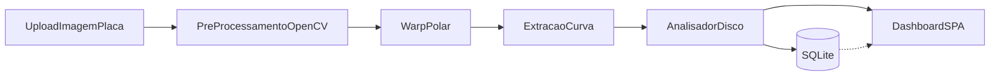

# Plano de Implementação — Leitor de Discos de Cronotacógrafo Analógico

**Projeto Integrador (PGI)** — Curso de Sistemas para Internet (Univali)  
**Produto:** CronotaScan (protótipo funcional)  
**Versão do documento:** 1.0  
**Baseado no estado do repositório:** API FastAPI `0.5.0` + SPA em `static/index.html`

---

## 1. Visão Geral do Sistema e Arquitetura

### 1.1 Proposta e problema de mercado

Transportadoras e departamentos de frota ainda dependem, em grande medida, da **leitura visual manual** de discos diagrama de cronotacógrafo analógico (papel circular de 24 horas). Esse processo é lento, sujeito a erro humano e dificulta a auditoria sistemática de excessos de velocidade e períodos de parada.

O **CronotaScan** propõe automatizar essa auditoria por meio de **visão computacional**: o usuário envia o escaneamento do disco; o sistema localiza o furo central, desdobra a geometria circular em um plano tempo × velocidade, extrai a curva do estilete, aplica regras de negócio e persiste o resultado para consulta posterior em um painel web.

O foco atual do protótipo é a **Fase 1 / escaneamentos controlados** (boa iluminação, disco bem enquadrado), com roadmap explícito para robustez em condições adversas e geração de laudos oficiais.

### 1.2 Fluxo da arquitetura



**Descrição do fluxo ponta a ponta**

1. **Entrada:** formulário web envia imagem do disco + placa do veículo (`multipart/form-data`) para `POST /upload-disco/`.
2. **Pré-processamento:** decodificação da imagem, conversão para escala de cinza e detecção do furo central (`cv2.HoughCircles`).
3. **Transformação polar:** `cv2.warpPolar` gera imagem retangular (eixo X ≈ 24 h; eixo Y ≈ 0–120 km/h); cópia salva em `temp/` para debug.
4. **Extração de sinal:** isolamento do traço do estilete (blur, limiar Otsu, morfologia), varredura coluna a coluna e suavização por média móvel.
5. **Análise de regras:** cálculo de distância estimada, velocidade máxima/média, excessos acima do limite e paradas prolongadas.
6. **Persistência:** gravação em SQLite (`leituras_viagem` e `infracoes`).
7. **Dashboard UI:** atualização dinâmica (métricas, Chart.js, imagem desdobrada e tabela de alertas) sem recarregar a página.

### 1.3 Módulos principais e responsabilidades

| Artefato | Responsabilidade |
| --- | --- |
| [`main.py`](main.py) | Aplicação FastAPI: serve a SPA (`GET /`), health check (`GET /api/health`), processamento (`POST /upload-disco/`), montagem de `/temp` e `/static`, orquestração do pipeline e commit no banco. |
| [`core/processador_imagem.py`](core/processador_imagem.py) | Classe `LeitorDisco`: carga em cinza, HoughCircles, `warpPolar`, salvamento em `temp/`, extração e suavização da curva de velocidade. |
| [`core/analisador.py`](core/analisador.py) | Classe `AnalisadorDisco`: regras de negócio (excesso, parada prolongada, integração velocidade × tempo para distância). |
| [`core/database.py`](core/database.py) | SQLAlchemy + SQLite (`tacografos.db`): models `LeituraViagem` e `Infracao`, `get_db()`, `criar_tabelas()`. |
| [`core/__init__.py`](core/__init__.py) | Exportação pública do pacote `core`. |
| [`static/index.html`](static/index.html) | SPA única: upload, placa, resumo, gráfico Chart.js, imagem de debug, infrações e placeholder de histórico. |
| [`requirements.txt`](requirements.txt) | Dependências: FastAPI, Uvicorn, OpenCV, NumPy, Pandas, python-multipart, SQLAlchemy. |
| `temp/` | Imagens desdobradas de debug (servidas em `/temp/...`). |
| `tacografos.db` | Banco SQLite local criado automaticamente na raiz. |

**Rotas expostas atualmente**

| Método | Rota | Função |
| --- | --- | --- |
| `GET` | `/` | Entrega `static/index.html` |
| `GET` | `/api/health` | Status da API |
| `POST` | `/upload-disco/` | Processa disco, analisa, persiste e retorna JSON |
| estático | `/temp/*` | Imagens de debug |
| estático | `/static/*` | Assets da interface |

**Observação de arquitetura:** a seta pontilhada `db -.-> ui` no diagrama indica a intenção de consulta ao histórico na interface. Hoje a **gravação** já ocorre; a **listagem filtrada** ainda não possui endpoint nem UI completa (Sprint 3).

---

## 2. Cronograma e Sprints de Desenvolvimento (Roadmap)

### Sprint 1 — Concluída  
**Núcleo de Visão Computacional e API inicial**

- Classe `LeitorDisco` com tipagem e comentários em português.
- Detecção do furo central via `cv2.HoughCircles`.
- Desdobramento circular → retangular com `cv2.warpPolar` (X = 24 h, Y = 0–120 km/h).
- Extração bruta da curva (pixel mais escuro por coluna).
- Servidor FastAPI com endpoint de upload e resposta JSON.
- Dependências básicas em `requirements.txt`.

**Critério de aceite atingido:** upload de imagem sintética/controlada retorna centro detectado e dimensões da imagem desdobrada.

---

### Sprint 2 — Concluída  
**Ruído, infrações, persistência e dashboard**

- Tratamento de ruído na curva: GaussianBlur, limiar Otsu, morfologia e média móvel.
- `AnalisadorDisco`: excesso de velocidade (limite padrão 80 km/h), paradas > 10 min, distância estimada.
- Persistência SQLite/SQLAlchemy (`LeituraViagem`, `Infracao`) no fluxo de upload, com placa obrigatória.
- SPA interativa (Bootstrap + Chart.js): resumo, gráfico, imagem de debug e tabela de alertas.
- Ajuste operacional da porta para **8080** (evita `WinError 10013` da porta 8000 no Windows).

**Critério de aceite atingido:** após o upload, a UI exibe análise completa e o registro é gravado em `tacografos.db` com `viagem_id` retornado no JSON.

---

### Sprint 3 — Próxima  
**Persistência avançada e histórico de relatórios**

- Endpoints de consulta, por exemplo:
  - listagem de viagens com filtro por placa;
  - filtro por período (`data_inicio` / `data_fim`);
  - detalhe de uma viagem (resumo + infrações).
- Substituição do placeholder “Histórico de leituras” em `static/index.html` por tabela/lista real.
- Paginação simples e ordenação por data decrescente.
- (Recomendado) uso de `pandas` para agregações/export intermediário CSV, se necessário na consulta.

**Critério de aceite proposto:** operador consulta viagens por placa e abre o detalhe de uma leitura passada sem reenviar a imagem.

---

### Sprint 4 — Futura  
**Exportação de laudos e documentação de auditoria**

- Geração automática de PDF por análise (placa, data, métricas, lista de infrações, referência à imagem desdobrada).
- Botões de download/impressão na SPA.
- Mecanismo simples de compartilhamento/alerta (e-mail ou arquivo exportável) para o gestor de frota.
- Trilha de auditoria: quem processou, quando e qual `viagem_id`.

**Critério de aceite proposto:** a partir de uma viagem persistida, o usuário baixa um laudo PDF reproduzível.

---

### Sprint 5 — Validação e apresentação para banca PGI  
**Robustez do algoritmo e documentação acadêmica**

- Banco de amostras reais em condições adversas (sombras, amassados, rotação, iluminação variável).
- Calibração fina dos parâmetros OpenCV e registro dos valores finais no memorial descritivo.
- Testes de estresse / regressão visual (antes/depois do desdobramento).
- Documentação acadêmica final: fundamentação metodológica, arquitetura, requisitos, evidências de testes e limitações do protótipo.

**Critério de aceite proposto:** demonstração estável na banca com pelo menos um conjunto documentado de discos reais e parâmetros calibrados.

---

## 3. Matriz de Requisitos e Critérios de Aceite

### 3.1 Requisitos Funcionais (RF)

| ID | Requisito | Critério de aceite (resumo) | Status |
| --- | --- | --- | --- |
| RF01 | Upload de imagem do disco via interface/API | Aceita PNG/JPEG e rejeita arquivos inválidos/vazios | **Concluído** |
| RF02 | Informar placa do veículo no processamento | Campo obrigatório enviado e persistido | **Concluído** |
| RF03 | Detectar furo central do disco | Retorna coordenadas `(x, y)` e raio | **Concluído** |
| RF04 | Desdobrar disco (polar → cartesiana) | Gera imagem com eixos tempo × velocidade | **Concluído** |
| RF05 | Salvar imagem desdobrada para debug | Arquivo em `temp/` acessível via `/temp/...` | **Concluído** |
| RF06 | Extrair curva de velocidade tratada | Lista `[{hora, velocidade_kmh}, ...]` com suavização | **Concluído** |
| RF07 | Detectar excesso de velocidade | Eventos com início, fim e velocidade máxima | **Concluído** |
| RF08 | Detectar paradas prolongadas (> 10 min) | Eventos de parada com duração | **Concluído** |
| RF09 | Calcular distância estimada da viagem | Integração velocidade × tempo no resumo | **Concluído** |
| RF10 | Persistir viagem e infrações no SQLite | Commit com `viagem_id` no JSON de resposta | **Concluído** |
| RF11 | Dashboard com métricas, gráfico e alertas | SPA atualiza sem reload após o upload | **Concluído** |
| RF12 | Listar histórico de leituras por placa/período | API + UI de consulta operacional | **Pendente** (placeholder na UI; gravação já existe) |
| RF13 | Exibir detalhe de viagem passada | Consulta por `viagem_id` com infrações | **Pendente** |
| RF14 | Exportar laudo oficial em PDF | Download/impressão do relatório da análise | **Pendente** |
| RF15 | Compartilhar/alertar gestor sobre infrações | Canal de notificação ou exportação dedicada | **Pendente** |

### 3.2 Requisitos Não Funcionais (RNF)

| ID | Requisito | Critério de aceite (resumo) | Status |
| --- | --- | --- | --- |
| RNF01 | Modularidade (visão × regras × API × UI) | Separação clara em `core/` + `main.py` + `static/` | **Concluído** |
| RNF02 | Tipagem e legibilidade para defesa | Type hints e comentários em português nos módulos principais | **Concluído** |
| RNF03 | Execução local simplificada | `venv` + `pip install -r requirements.txt` + `python main.py` | **Concluído** |
| RNF04 | Persistência leve sem servidor de BD externo | SQLite em `tacografos.db` | **Concluído** |
| RNF05 | Usabilidade para operador de transportadora | Fluxo curto: placa → arquivo → resultado visual | **Concluído** (protótipo) |
| RNF06 | Robustez a discos em condições adversas | Taxa aceitável de acerto em amostras reais degradadas | **Pendente** (Sprint 5) |
| RNF07 | Suite de testes automatizados | Testes unitários/integração do pipeline e da API | **Pendente** |
| RNF08 | Documentação acadêmica e de manutenção | Plano, memorial e guia de calibração anexáveis ao PGI | **Em progresso** (este documento) |
| RNF09 | Desempenho interativo no protótipo | Resposta do upload em tempo aceitável em máquina local | **Concluído** (escopo protótipo) |

---

## 4. Diretrizes de Manutenção, Testes e Calibração

### 4.1 Calibração dos parâmetros OpenCV e de análise

Os parâmetros mais sensíveis estão concentrados em `core/processador_imagem.py` e `core/analisador.py` / `main.py`.

#### Detecção do furo (`encontrar_furo_central`)

| Parâmetro | Valor atual (referência) | Efeito prático |
| --- | --- | --- |
| `GaussianBlur` | `(9, 9)`, sigma `2` | Reduz ruído; valores altos demais apagam o furo |
| `dp` | `1.2` | Resolução do acumulador de Hough |
| `param1` | `100` | Limiar interno do Canny |
| `param2` | `30` | Sensibilidade (menor = mais círculos candidatos) |
| `minRadius` / `maxRadius` | relativos ao menor lado da imagem | Adequar ao tamanho do furo no escaneamento |

**Como calibrar:** processar a mesma amostra alterando `param2` e os raios; inspecionar se o centro retornado coincide com o furo físico. Em falha recorrente (`Nenhum furo central foi detectado`), priorizar enquadramento/iluminação e só então afrouxar `param2`.

#### Extração do traço (`_preparar_imagem_para_traco` / `extrair_curva_velocidade`)

| Parâmetro | Valor atual (referência) | Efeito prático |
| --- | --- | --- |
| Blur pré-limiar | `(9, 9)` | Atenua grade impressa do papel |
| Limiar | Otsu invertido | Separa tinta escura do fundo |
| Abertura morfológica | elipse `3×3` | Remove resíduos finos da grade |
| Janela da média móvel | `5` pontos (~5 min) | Suaviza picos falsos de sujeira |
| Corte de “parado” | `< 0.5 km/h → 0.0` | Estabiliza detecção de paradas |

**Como calibrar:** comparar a imagem em `temp/` com o gráfico Chart.js. Se a curva “gruda” na grade, reforçar blur/morfologia. Se apaga o estilete, reduzir agressividade do limiar/morfologia. Se houver dentes artificiais, aumentar a janela da média móvel com cautela (perda de detalhe temporal).

#### Resolução do desdobramento

| Constante | Valor | Significado |
| --- | --- | --- |
| `LARGURA_PADRAO_PX` | `1440` | ≈ 1 pixel por minuto em 24 h |
| `ALTURA_PADRAO_PX` | `480` | Faixa vertical de 0–120 km/h |
| `VELOCIDADE_MAXIMA_KMH` | `120` | Escala do eixo Y |

#### Regras de negócio (`AnalisadorDisco` / `main.py`)

| Parâmetro | Valor atual | Observação |
| --- | --- | --- |
| `LIMITE_VELOCIDADE_PADRAO_KMH` | `80.0` | Limite de excesso no protótipo |
| `MINUTOS_PARADA_PROLONGADA` | `10` | Paradas contínuas acima disso geram alerta |
| `TOLERANCIA_PARADO_KMH` | `0.5` | Compensa resíduos pós-suavização |

Ajuste esses valores conforme a política interna da transportadora ou a norma adotada no PGI, documentando a decisão na banca.

### 4.2 Instalação e execução local

```powershell
cd E:\CRONOTACOGRAFOS
python -m venv .venv
.\.venv\Scripts\Activate.ps1
python -m pip install -r requirements.txt
python main.py
```

Acesse a interface em: `http://127.0.0.1:8080/`  
Documentação interativa da API (Swagger): `http://127.0.0.1:8080/docs`  
Health check: `http://127.0.0.1:8080/api/health`

> **Nota:** a porta **8080** é intencional. Em muitos ambientes Windows a porta 8000 fica reservada pelo sistema (`WinError 10013`).

### 4.3 Procedimentos de limpeza e reinício do banco

**Limpar imagens de debug**

```powershell
Remove-Item -Path E:\CRONOTACOGRAFOS\temp\* -Force -ErrorAction SilentlyContinue
```

A pasta `temp/` é recriada automaticamente quando necessário.

**Reiniciar o banco SQLite (apaga todo o histórico)**

1. Pare o servidor (`Ctrl + C`).
2. Remova o arquivo do banco:

```powershell
Remove-Item -Path E:\CRONOTACOGRAFOS\tacografos.db -Force
```

3. Suba novamente com `python main.py`.  
   As tabelas serão recriadas por `criar_tabelas()` no startup da API.

**Backup recomendado antes de testes destrutivos**

```powershell
Copy-Item E:\CRONOTACOGRAFOS\tacografos.db E:\CRONOTACOGRAFOS\tacografos.backup.db
```

### 4.4 Procedimento mínimo de verificação (smoke test)

1. Ativar o ambiente virtual e iniciar `python main.py`.
2. Abrir `http://127.0.0.1:8080/`.
3. Informar uma placa (ex.: `ABC-1234`) e enviar um escaneamento de disco.
4. Confirmar na tela: métricas, gráfico, imagem desdobrada e lista de infrações (se houver).
5. Confirmar no JSON/UI a presença de `viagem_id`.
6. Inspecionar fisicamente o PNG gerado em `temp/` e o crescimento de `tacografos.db`.

### 4.5 Limitações conhecidas do protótipo (transparência para a banca)

- Otimizado para **escaneamentos limpos**; discos amassados/mal iluminados exigem calibração (Sprint 5).
- A orientação angular absoluta do “zero hora” no disco físico ainda depende do enquadramento do escaneamento.
- O histórico é **persistido**, mas a **consulta operacional completa** (filtros e detalhe) permanece na Sprint 3.
- `pandas` está nas dependências e ainda não é usado de forma central no pipeline (oportunidade nas Sprints 3–4).
- Não há, no momento, autenticação de usuários nem controle de acesso multiempresa.

---

## Referência rápida da estrutura do repositório

```text
CRONOTACOGRAFOS/
├── main.py
├── requirements.txt
├── PLANO_DE_IMPLEMENTACAO.md
├── tacografos.db                 # gerado em runtime
├── temp/                         # imagens de debug
├── static/
│   └── index.html                # SPA
└── core/
    ├── __init__.py
    ├── processador_imagem.py     # LeitorDisco
    ├── analisador.py             # AnalisadorDisco
    └── database.py               # SQLAlchemy / SQLite
```

---

*Documento elaborado para controle interno de desenvolvimento e anexação à fundamentação metodológica do Projeto Integrador (PGI).*
